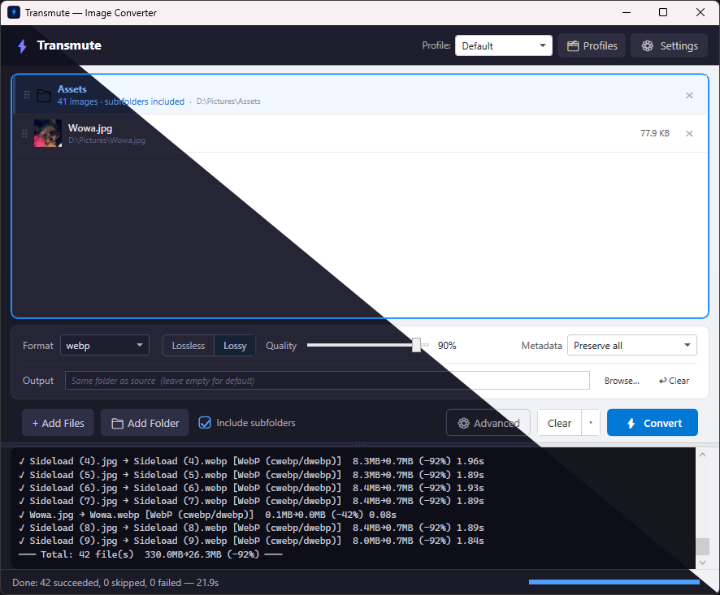
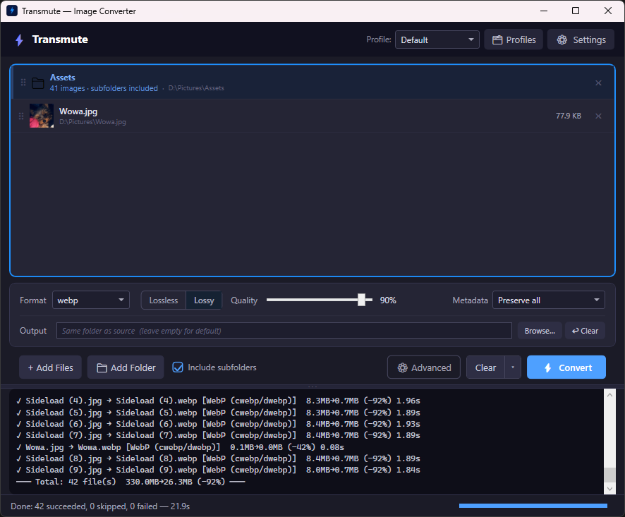
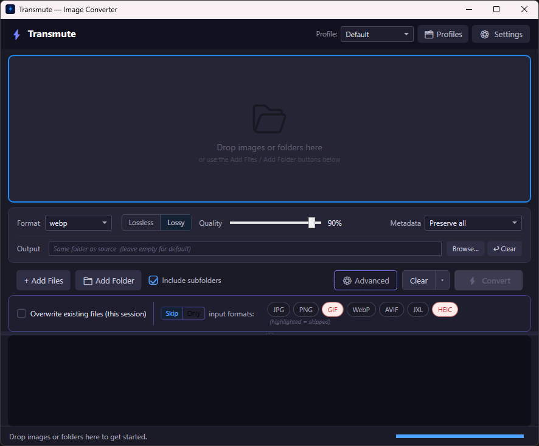

# Transmute
**A smart, multi-backend image converter for Windows — with both a GUI and a full-featured CLI.**

Transmute converts images between formats using the best available tool for the job. Drop files into the GUI, or script bulk conversions with the CLI. It automatically selects from up to five conversion backends (libvips, cwebp, cjxl, ffmpeg, ImageMagick), chains them together when needed, and degrades gracefully when some are not installed.


<p align="center">
  
  <br><em>Light and dark theme</em>
</p>

---

## Table of Contents

- [Features](#features)
- [Preview](#preview)
- [Supported Formats](#supported-formats)
- [Requirements & Installation](#requirements--installation)
  - [Installing Backends](#installing-backends)
  - [Portable vs Installed Mode](#portable-vs-installed-mode)
- [Quick Start](#quick-start)
  - [GUI Quick Start](#gui-quick-start)
  - [CLI Quick Start](#cli-quick-start)
- [CLI Reference](#cli-reference)
  - [convert](#convert)
  - [watch](#watch)
  - [info](#info)
  - [backends](#backends)
  - [config](#config)
  - [profile](#profile)
- [Profiles](#profiles)
- [Configuration](#configuration)
- [Output Naming Patterns](#output-naming-patterns)
- [Metadata Handling](#metadata-handling)
- [Log Files](#log-files)
- [Building from Source](#building-from-source)

---

## Features

- **GUI and CLI** — a clean Avalonia interface for interactive use and a full CLI for scripting and automation
- **Smart backend routing** — automatically picks the right converter (libvips, cwebp, cjxl, ffmpeg, ImageMagick) based on format pair
- **Two-step conversion** — chains backends transparently when no single tool can handle a format pair directly
- **Graceful fallback** — if a preferred backend isn't installed, Transmute falls back rather than failing
- **Batch conversion** — convert entire folders at once, with optional recursive traversal
- **Watch mode** — monitor a folder and automatically convert new files as they arrive
- **Named profiles** — save reusable sets of quality, metadata, filter, and output settings
- **Format filters** — skip or exclusively target specific input extensions
- **Flexible output naming** — template-based patterns with date, counter, and original name tokens
- **Metadata control** — preserve all, strip all, keep colour profile only, or keep copyright fields only
- **Dry-run mode** — preview what would be converted and where output files would go, without converting
- **Verbose mode** — see exactly which backend was chosen and why, per file
- **Log files** — optional text or JSON conversion log written alongside output files
- **Stdin piping** — feed file paths from other tools via stdin
- **Light / Dark / System theme** — full dark mode support across all windows

---

## Preview

<p align="center">
  
  <br><em>Batch conversion complete — 42 files, 330 MB → 26.3 MB (-92%)</em>
</p>

<p align="center">
  
  <br><em>Advanced panel with per-session format filters</em>
</p>

---

## Supported Formats

### Output Formats
| Format | Extension | Notes |
|--------|-----------|-------|
| WebP | `.webp` | Lossy or lossless |
| JPEG XL | `.jxl` | Lossy or lossless, modern format |
| AVIF | `.avif` | Efficient lossy/lossless, wide browser support |
| JPEG | `.jpg` / `.jpeg` | Universal compatibility |
| PNG | `.png` | Lossless |
| TIFF | `.tiff` / `.tif` | High-quality archival |
| GIF | `.gif` | Animated GIF output via ffmpeg |
| HEIF / HEIC | `.heif` / `.heic` | Apple ecosystem format |
| BMP | `.bmp` | |
| And more | — | Many additional formats via ImageMagick |

### Input Formats
JPEG, PNG, WebP, AVIF, HEIF/HEIC, TIFF, GIF (animated), APNG (animated), BMP, JPEG 2000, SVG, HDR, and many more via ImageMagick (PSD, PDF, EPS, EXR, ICO, DPX, XCF, etc.).

---

## Requirements & Installation

**Runtime:** .NET 9.0

Download the latest release from the [Releases page](../../releases). Extract the zip and run `transmute-avalonia.exe` for the GUI or `transmute.exe` for the CLI.

Transmute itself has no mandatory dependencies beyond .NET 9, but it needs at least one backend installed to do anything useful. libvips covers the most ground and is the recommended starting point.

### Installing Backends

Transmute discovers backends automatically from your system `PATH`. All backends are optional — install whichever formats you need:

| Backend | What it adds | Get it |
|---------|-------------|--------|
| **libvips** | Fast general-purpose conversion (JPEG, PNG, TIFF, AVIF, HEIC, WebP, JP2, SVG, …) | [libvips.github.io](https://libvips.github.io/libvips/) |
| **cwebp / dwebp** | Best-quality WebP encoding and decoding | [developers.google.com/speed/webp](https://developers.google.com/speed/webp/docs/precompiled) |
| **cjxl / djxl** | JPEG XL encoding and decoding | [github.com/libjxl/libjxl](https://github.com/libjxl/libjxl/releases) |
| **ffmpeg** | Animated GIF/APNG/WebP, video frame extraction | [ffmpeg.org/download.html](https://ffmpeg.org/download.html) |
| **ImageMagick** | Broad format fallback (PSD, EPS, EXR, PDF, ICO, …) | [imagemagick.org](https://imagemagick.org/script/download.php) |

Add each backend's `bin` folder to your system PATH, or check which ones Transmute can already find:

```
transmute backends
```

If a binary isn't on `PATH`, you can point Transmute directly to it. The paths below are **examples** — use wherever you actually installed the tool:

```
transmute config set binaries.cwebp "C:\path\to\cwebp.exe"
transmute config set binaries.cjxl  "C:\path\to\cjxl.exe"
```

### Portable vs Installed Mode

- **Portable mode:** config and profiles live next to the executable. Place a file named `portable` beside the exe, or Transmute will auto-activate portable mode if `config.json` already exists there.
- **Installed mode (default):** config and profiles are stored in `%APPDATA%\Roaming\Transmute\`.

---

## Quick Start

### GUI Quick Start

1. Launch `transmute-avalonia.exe`
2. Drag images or folders onto the window (or use **Ctrl+O** to browse)
3. Pick a target format from the dropdown
4. Adjust quality, or JPEG XL distance, if needed
5. Click **Convert**

The log panel at the bottom shows live progress. When finished, a summary line shows how many files succeeded, were skipped, or failed.

**Tips:**
- Use the **Profile** dropdown to switch between saved conversion presets
- Open **Settings** (`Ctrl+,`) to configure default quality, JPEG XL distance, output directory, and backend paths
- Open the **Profile Manager** (`Ctrl+Shift+P`) to create and manage named profiles
- Press **Delete** to remove selected items from the queue
- Expand the **Advanced** panel to set per-session format filters

---

### CLI Quick Start

```bash
# Convert a single image
transmute convert photo.jpg --format webp

# Convert all images in the current folder
transmute convert . --format webp

# Convert a folder recursively
transmute convert ./photos --format jxl --recursive

# Preview what would happen without converting
transmute convert ./photos --format avif --dry-run

# Watch a folder and convert new images automatically
transmute watch ./inbox --format webp --output-dir ./converted
```

---

## CLI Reference

### `convert`

Convert one or more images to a target format.

```
transmute convert <inputs...> --format <fmt> [options]
```

`<inputs>` can be:
- A file path: `photo.jpg`
- A folder path: `./photos` or `.` (current directory)
- Multiple paths: `a.jpg b.png ./folder`
- `-` to read paths from stdin (one per line)

#### Required

| Option | Short | Description |
|--------|-------|-------------|
| `--format <fmt>` | `-f` | Target format: `webp`, `jxl`, `avif`, `jpg`, `png`, `tiff`, `gif`, etc. |

#### Output

| Option | Short | Description |
|--------|-------|-------------|
| `--output <path>` | `-o` | Explicit output path — single input only |
| `--output-dir <path>` | | Write all output files to this directory |
| `--name-pattern <pattern>` | `-n` | Filename template, e.g. `{name}-web.{ext}` — see [Output Naming Patterns](#output-naming-patterns) |
| `--overwrite` | | Overwrite existing output files (default: skip) |

#### Quality

| Option | Short | Description |
|--------|-------|-------------|
| `--quality <0–100>` | `-q` | Lossy quality — applies to WebP, JXL, AVIF, JPEG |
| `--lossless` | `-l` | Lossless encoding (WebP and JXL only) |
| `--method <0–6>` | | WebP compression method (0 = fastest, 6 = best) |
| `--effort <1–9>` | `-e` | JXL effort level (1 = fastest, 9 = best) |
| `--distance <0–2>` | `-d` | JXL distance: 0 = lossless, 0.1–1.0 = visually lossless, 1.1–2 = lossy |

#### Filtering

| Option | Description |
|--------|-------------|
| `--skip <exts>` | Skip input files with these extensions. Comma-separated or repeated: `--skip jpg,png` or `--skip jpg --skip png` |
| `--only <exts>` | Process ONLY files with these extensions. Replaces `--skip` and any profile filter |
| `--recursive` `-r` | Include files in subdirectories |

#### Advanced

| Option | Short | Description |
|--------|-------|-------------|
| `--profile <name>` | `-p` | Apply a named profile for defaults (CLI flags override profile values) |
| `--metadata <mode>` | `--meta` | Metadata handling: `preserve` (default), `strip`, `color`, `copyright` |
| `--backend <name>` | | Force a specific backend: `webp`, `jxl`, `ffmpeg`, `vips`, `magick` |
| `--jobs <n>` | `-j` | Parallel conversions (0 = CPU count) |
| `--log` | | Write a log file even if disabled in config |
| `--no-log` | | Skip the log file even if enabled in config |
| `--log-format <fmt>` | | Log format: `text` or `json` |
| `--dry-run` | | Show what would be converted without converting |
| `--verbose` | `-v` | Per-file detail: backend chosen, reason, settings, size delta |

#### Examples

```bash
# Batch convert to WebP at quality 85
transmute convert ./photos --format webp --quality 85

# Lossless JXL, recursive, output to separate folder
transmute convert ./originals --format jxl --lossless --recursive --output-dir ./archive

# Visually lossless JXL using explicit distance
transmute convert ./photos --format jxl --distance 0.8

# HEIC to AVIF, skip any existing WebP files
transmute convert . --format avif --skip webp

# Only convert JPEGs in a mixed folder
transmute convert ./mixed --format webp --only jpg,jpeg

# Verbose output to see backend decisions
transmute convert image.heic --format avif --verbose

# Re-encode with overwrite using a profile
transmute convert . --format webp --profile social-media --overwrite

# Pipe a file list from another tool
find ./photos -name "*.png" | transmute convert - --format webp

# Custom naming pattern with date prefix
transmute convert ./batch --format webp --name-pattern "{date}_{name}.{ext}"
```

---

### `watch`

Monitor a folder and convert new images as they arrive.

```
transmute watch <folder> --format <fmt> [options]
```

Transmute waits for each file to finish being written before processing it (configurable stability window). Temporary files (`.tmp`, `.part`, `.crdownload`, etc.) are ignored. Press **Ctrl+C** to stop watching.

#### Options

| Option | Short | Description |
|--------|-------|-------------|
| `--format <fmt>` | `-f` | Target format (required) |
| `--output-dir <path>` | `-o` | Write converted files here (default: same folder) |
| `--recursive` | `-r` | Watch subdirectories too |
| `--profile <name>` | `-p` | Use a named profile for defaults |
| `--stable-time <ms>` | | Milliseconds a file must be unchanged before processing (default: 500, min: 50) |
| `--quality <0–100>` | `-q` | Lossy quality |
| `--distance <0–2>` | `-d` | JXL distance; overrides quality for JXL output |
| `--lossless` | | Lossless encoding |
| `--overwrite` | | Overwrite existing output files |
| `--metadata <mode>` | | Metadata handling |
| `--jobs <n>` | `-j` | Parallel conversions |
| `--verbose` | `-v` | Detailed per-file output |

#### Examples

```bash
# Watch inbox, convert everything to WebP
transmute watch ./inbox --format webp --output-dir ./web

# Watch recursively, use a profile, verbose output
transmute watch ./camera-import --format jxl --recursive --profile archival --verbose

# Longer stable window for slow network drives
transmute watch \\server\share\uploads --format avif --stable-time 2000
```

---

### `info`

Show routing information for a file — what backend would be chosen and why.

```
transmute info <file>
```

```
transmute info photo.heic
```

Output shows file path, size, detected extension, backend affinity, and any warnings (e.g. if the file would be treated as animated or video).

---

### `backends`

List all supported backends and whether they are available on this machine.

```
transmute backends
```

```
Backend      Status       Formats
-----------  -----------  -----------------------------------------------
libvips      Available    jpg, jpeg, png, tiff, tif, webp, avif, heif ...
cwebp/dwebp  Available    png, jpg, jpeg, tiff, tif, bmp, ppm ...
cjxl/djxl    Available    jxl, png, jpg, jpeg, apng, gif, exr ...
ffmpeg       Available    gif, apng, webp, mp4, mkv, avi, mov ...
magick       Not found    (install ImageMagick and add to PATH)
```

---

### `config`

Read and write global configuration values.

```
transmute config get [key]
transmute config set <key> <value>
transmute config reset
transmute config path
```

Keys use dot notation: `section.property` — for example `defaults.webpQuality` or `processing.maxParallelJobs`.

To read/write a **profile's** values instead of global config, pass `--profile <name>` (`-p`).

#### `config get`

```bash
# Show entire config
transmute config get

# Show one value
transmute config get defaults.webpQuality

# Show a profile's value
transmute config get --profile social-media defaults.webpQuality
```

#### `config set`

```bash
# Set global default quality
transmute config set defaults.webpQuality 80

# Set a value on a named profile (profile must exist first)
transmute config set --profile archival defaults.losslessDefault true
transmute config set --profile archival defaults.jxlDistance 0.8

# Clear a profile override (revert to inheriting from global)
transmute config set --profile archival defaults.webpQuality null
```

#### Common Keys

| Key | Type | Description |
|-----|------|-------------|
| `defaults.webpQuality` | int | Default WebP quality (0–100) |
| `defaults.jpegQuality` | int | Default JPEG quality (0–100) |
| `defaults.jxlQuality` | int | Default JXL quality (0–100) |
| `defaults.avifQuality` | int | Default AVIF quality (0–100) |
| `defaults.metadataMode` | string | `PreserveAll`, `StripAll`, `ColorProfile`, `Copyright` |
| `defaults.overwriteExisting` | bool | Overwrite output files by default |
| `defaults.losslessDefault` | bool | Default lossless mode for JXL and WebP |
| `defaults.webpMethod` | int | WebP compression method (0–6) |
| `defaults.jxlEffort` | int | JXL effort (1–9) |
| `defaults.jxlDistance` | double | JXL distance when lossy JXL is the default |
| `defaults.defaultOutputDirectory` | string | Default output directory (`null` = beside input) |
| `defaults.outputNamingPattern` | string | Filename pattern (e.g. `{name}.{ext}`) |
| `processing.maxParallelJobs` | int | Parallel jobs (0 = CPU count) |
| `processing.vipsConcurrency` | int | libvips thread count (0 = auto) |
| `processing.tempDirectory` | string | Temp dir for intermediate files |
| `log.enabled` | bool | Write log file after conversion |
| `log.format` | string | `text` or `json` |
| `binaries.cwebp` | string | Path to `cwebp.exe` (null = search PATH) |
| `binaries.cjxl` | string | Path to `cjxl.exe` |
| `binaries.ffmpeg` | string | Path to `ffmpeg.exe` |
| `binaries.magick` | string | Path to `magick.exe` |

---

### `profile`

Create and manage named conversion profiles.

```
transmute profile list
transmute profile create <name>
transmute profile duplicate <source> <name>
transmute profile rename <old-name> <new-name>
transmute profile delete <name> [--yes]
transmute profile show [name] [--effective]
transmute profile path
```

#### Examples

```bash
# List all profiles
transmute profile list

# Create a new empty profile
transmute profile create "web-optimised"

# Set values on the new profile
transmute config set --profile web-optimised defaults.webpQuality 82
transmute config set --profile web-optimised defaults.metadataMode StripAll

# Show profile values (inherited nulls shown as "inherited")
transmute profile show web-optimised

# Show effective values after merging with global config
transmute profile show web-optimised --effective

# Duplicate Default profile as a starting point
transmute profile duplicate Default archival

# Rename
transmute profile rename archival archive-lossless

# Delete without prompt
transmute profile delete archive-lossless --yes
```

---

## Profiles

Profiles are named sets of conversion defaults. When you pass `--profile <name>` to `convert` or `watch`, those defaults apply — but any flag you also pass on the command line takes priority.

Profiles can override:
- Quality per format (WebP, JPEG, JXL, AVIF)
- Lossless mode
- WebP method, JXL effort, and JXL distance
- Metadata mode
- Overwrite behaviour
- Default output directory
- Output naming pattern
- Format filter (skip or only a set of extensions)

Profile values that are left `null` inherit from global config. This means you only need to set what you want to differ from your global defaults.

**The Default profile is special** — it's not stored as a file, it's just the global config defaults. You can't delete it, but you can read and set its values with `transmute config get/set`.

### Format Filters in Profiles

A profile can have either a `skipFormats` list or an `onlyFormats` list (not both):

- **skipFormats:** Files with these extensions are ignored during folder conversions. Useful if a folder has a mix of formats and you want to skip ones that are already good (e.g. skip `.avif` and `.jxl` when batch-converting to WebP).
- **onlyFormats:** Only files with these extensions are processed. Everything else is ignored.

When a filter is active, Transmute prints a notice at the start of conversion. CLI flags `--skip` and `--only` completely replace any profile filter for that run.

---

## Configuration

Transmute stores its configuration in a JSON file. Run `transmute config path` to find its location.

### Full Config Structure

```jsonc
{
  // External binary paths — null means auto-discover on PATH
  "binaries": {
    "cwebp": null,
    "dwebp": null,
    "cjxl": null,
    "djxl": null,
    "ffmpeg": null,
    "magick": null
  },

  // Processing behaviour
  "processing": {
    "maxParallelJobs": 0,    // 0 = one job per logical CPU
    "tempDirectory": null,   // null = %TEMP%\Transmute
    "vipsConcurrency": 0     // libvips thread count (0 = let libvips decide)
  },

  // Global conversion defaults (overridden per-profile or per-flag)
  "defaults": {
    "webpQuality": 85,
    "jpegQuality": 90,
    "jxlQuality": 90,
    "avifQuality": 80,
    "metadataMode": "PreserveAll",   // PreserveAll | StripAll | ColorProfile | Copyright
    "overwriteExisting": false,
    "losslessDefault": true,          // Lossless on for JXL and WebP by default
    "webpMethod": 6,                  // 0 (fast) – 6 (best)
    "jxlEffort": 7,                   // 1 (fast) – 9 (best)
    "jxlDistance": 1.0,               // JXL distance when lossy JXL is the default
    "defaultOutputDirectory": null,   // null = output beside input file
    "outputNamingPattern": "{name}.{ext}"
  },

  // Log file output
  "log": {
    "enabled": false,
    "format": "text"   // text | json
  },

  // GUI settings
  "ui": {
    "playSoundOnCompletion": false,
    "theme": "System"   // System | Light | Dark
  }
}
```

---

## Output Naming Patterns

Control output filenames using a template string with token substitution.

| Token | Replaced with |
|-------|--------------|
| `{name}` | Input filename without extension |
| `{ext}` | Output format extension |
| `{original_ext}` | Input file extension |
| `{date}` | Conversion date in `yyyyMMdd` format |
| `{counter}` | Sequential number, zero-padded to match total file count |

**Examples:**

| Pattern | Input | Output |
|---------|-------|--------|
| `{name}.{ext}` *(default)* | `photo.jpg` | `photo.webp` |
| `{name}-web.{ext}` | `photo.jpg` | `photo-web.webp` |
| `{date}_{name}.{ext}` | `photo.jpg` | `20260609_photo.webp` |
| `{counter}_{name}.{ext}` | `photo.jpg` (file 3 of 120) | `003_photo.webp` |
| `{name}.{original_ext}.{ext}` | `photo.jpg` | `photo.jpg.webp` |

Set via CLI (`--name-pattern`), profile, or global config.

---

## Metadata Handling

Control what metadata is preserved in output files.

| Mode | `--metadata` value | What is kept |
|------|--------------------|-------------|
| **Preserve All** *(default)* | `preserve` | EXIF, XMP, IPTC, ICC colour profile — nothing is stripped |
| **Strip All** | `strip` | No metadata — smallest file size, best for privacy |
| **Colour Profile Only** | `color` | ICC colour profile only — prevents colour shifts without leaking personal data |
| **Copyright Only** | `copyright` | Creator, copyright, and usage rights fields only — strips location and device data |

---

## Log Files

Transmute can write a log file alongside your output files summarising every conversion in a batch.

Enable globally in config (`log.enabled = true`), or per-run with `--log`. Suppress with `--no-log`.

Log files are named `transmute-YYYYMMDD-HHmmss.log` (or `.json`) and are written to the output directory.

### Text Log

```
Transmute Conversion Log
Generated : 2026-06-09 14:30:00
Duration  : 15.3s
Results   : 4 file(s)

  ✓ C:\Photos\img001.jpg
    → C:\Photos\img001.webp  [libvips]  2.1MB→1.4MB (-33%)  0.45s
  ✓ C:\Photos\img002.heic
    → C:\Photos\img002.webp  [libvips → libvips]  4.8MB→2.1MB (-56%)  1.20s
  ⊘ C:\Photos\img003.webp
    → skipped (output already exists)
  ✗ C:\Photos\img004.psd
    → failed: no backend available for .psd → .webp

Summary: 2 succeeded, 1 skipped, 1 failed
```

### JSON Log

```json
{
  "generated": "2026-06-09T14:30:00",
  "durationSeconds": 15.3,
  "results": [
    {
      "input": "C:\\Photos\\img001.jpg",
      "output": "C:\\Photos\\img001.webp",
      "status": "success",
      "backend": "libvips",
      "inputBytes": 2202000,
      "outputBytes": 1474000,
      "elapsedSeconds": 0.45
    }
  ],
  "summary": { "succeeded": 2, "skipped": 1, "failed": 1 }
}
```

---

## Building from Source

**Prerequisites:**
- [.NET 9 SDK](https://dotnet.microsoft.com/download/dotnet/9)

```bash
git clone https://github.com/Stremkoz/transmute
cd transmute

# Build everything
dotnet build

# Run tests
dotnet test

# Publish self-contained Windows release
dotnet publish src/Transmute.Avalonia/Transmute.Avalonia.csproj -c Release -r win-x64 --self-contained
dotnet publish src/Transmute.CLI/Transmute.CLI.csproj -c Release -r win-x64 --self-contained
```

> The original WPF GUI (`src/Transmute.GUI/`) is archived and retired; it remains on disk
> as a reference implementation but is no longer built or published.

Output lands in `publish/`.

---

## License

MIT — see [LICENSE](LICENSE).
